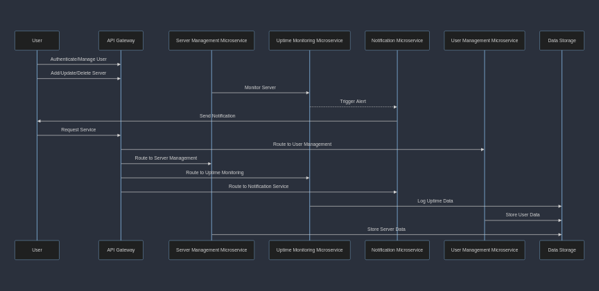

# Server Monitoring App

## Index

1. [High-Level Design Document](#high-level-design-document)
   - [System Overview](#system-overview)
   - [Microservices Architecture](#microservices-architecture)
   - [Communication Protocols](#communication-protocols)
   - [Data Storage](#data-storage)
   - [Scalability](#scalability)
   - [Load Balancing](#load-balancing)
   - [Caching](#caching)
   - [Monitoring and Logging](#monitoring-and-logging)
   - [Asynchronous Processing](#asynchronous-processing)
   - [Scalable Frontend](#scalable-frontend)
   - [CI/CD](#cicd)
2. [Low-Level Design Document](#low-level-design-document)
   - [Detailed Component Design](#detailed-component-design)

## High-Level Design Document

### System Overview

The server uptime monitoring tool is designed as a highly scalable, microservice-based application. It enables users to monitor server uptime, receive notifications in case of downtime, and manage server details.

#### Microservices Architecture

1. **User Management Microservice**

   - **Responsibilities**: User authentication, authorization, and user-related functionalities.
   - **Technology Stack**: Node.js, Express, PostgreSQL, JWT for authentication.

2. **Server Management Microservice**

   - **Responsibilities**: CRUD operations for servers.
   - **Technology Stack**: Node.js, Express, PostgreSQL.

3. **Uptime Monitoring Microservice**

   - **Responsibilities**: Monitoring server uptime, sending alerts, updating status.
   - **Technology Stack**: Node.js, Express, InfluxDB.

4. **Notification Microservice**
   - **Responsibilities**: Handling notifications (email, SMS).
   - **Technology Stack**: Go, RabbitMQ for message queuing.

#### Communication Protocols

- HTTP/REST

#### Data Storage

- PostgreSQL for User and Server Management.
- InfluxDB for Uptime Data.

#### Scalability

- Containerization with Docker.
- Orchestration with Kubernetes.

#### Load Balancing

- Use of load balancers like Nginx.

#### Caching

- Redis for caching frequently accessed data.

#### Monitoring and Logging

- Prometheus for monitoring.
- ELK Stack for logging.

#### Asynchronous Processing

- RabbitMQ or Apache Kafka for message queuing.

#### Scalable Frontend

- React.js.

#### CI/CD

- Jenkins.

## Low-Level Design Document

### Detailed Component Design

1. **User Management Microservice**

   **Database Schema**

   - Users Table: `id`, `username`, `password_hash`, `email`, `created_at`.
   - Roles Table: `id`, `role_name`.
   - UserRoles Table: `user_id`, `role_id`.

   **API Endpoints**

   - `/login`: Authenticate users.
   - `/register`: Register new users.
   - `/user`: Fetch user details.

2. **Server Management Microservice**

   **Database Schema**

   - Servers Table: `id`, `user_id`, `server_name`, `server_ip`, `created_at`.

   **API Endpoints**

   - `/server/add`: Add new server.
   - `/server/update`: Update server details.
   - `/server/delete`: Delete server.

3. **Uptime Monitoring Microservice**

   **Processing Logic**

   - Periodic checks on server status.
   - Record uptime/downtime in InfluxDB.
   - Trigger alerts if server is down.

4. **Notification Microservice**

   **Processing Logic**

   - Listen to message queue for downtime alerts.
   - Send email/SMS notifications to users.

5. **API Gateway**

   **Functionality**

   - Request routing to appropriate microservices.
   - Authentication and authorization.

6. **Frontend Application**

   **Features**

   - User authentication.
   - Server management interface.
   - Uptime statistics and alerts display.

7. **Security Considerations**

   **Implementation Details**

   - JWT for secure authentication.
   - HTTPS for secure communication.

8. **Monitoring and Logging**

   **Tools and Strategies**

   - Prometheus for system metrics.
   - ELK Stack for aggregating and analyzing logs.
